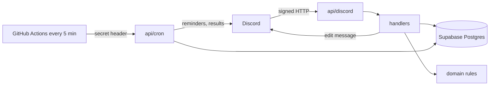

# Architecture overview

## Context and constraints
One guild at first, later possibly many (NFR-004). Free tiers only (NFR-003). Discord requires an acknowledgement within 3 seconds (NFR-002). Security rules are in NFR-001, reliability in NFR-005.

## Components

| Component | Responsibility | Depends on |
|---|---|---|
| `api/discord.ts` | Verify the signature, route commands, components and modals | `src/commands`, `src/components` |
| `api/cron.ts` | Check the secret, run scheduled jobs | `src/db`, `src/render`, Discord REST |
| `src/domain/` | Pure rules: tier, slot and UTC parsers, roster and vote rules | none |
| `src/commands/`, `src/components/` | Handlers per command and per button or menu | `src/domain`, `src/db`, `src/render` |
| `src/render/` | Build the roster embed and components | `src/domain` |
| `src/db/` | Parameterized queries and migrations | Supabase Postgres |
| GitHub Actions workflow | Call `/api/cron` every 5 minutes | `api/cron.ts` |

## Diagram

## Data and flows
Tables, all keyed by `guild_id`: `guild_settings`, `content`, `slot`, `signup`, `vote`, `attendance`. A partial unique index allows one signed member per slot, so concurrent claims resolve in the database. Tiers are stored as number pairs so ranges compare. Flow: Discord request, signature check, acknowledge, change state in one transaction, rebuild the roster from the database, edit the message. Unmarked attendance is "not recorded".

## Decisions
[0001 hosting and stack](../decisions/0001-hosting-and-stack.md), [0002 scheduled jobs](../decisions/0002-scheduled-jobs-github-actions.md), [0003 permissions](../decisions/0003-permissions-and-creation-cap.md), [0004 slot model](../decisions/0004-slot-model.md), [0005 vote cutoff](../decisions/0005-vote-cutoff.md).
